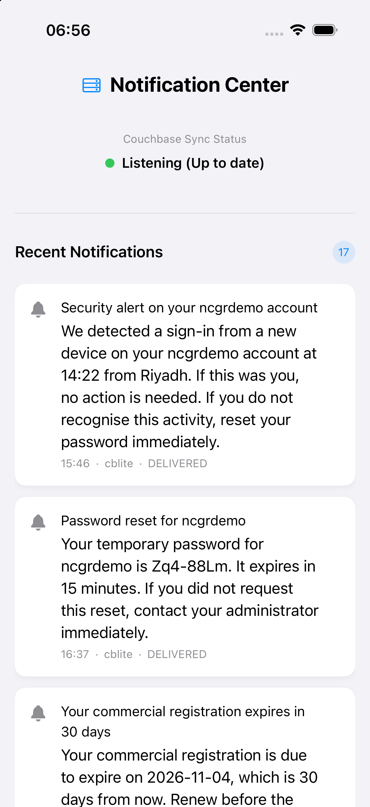
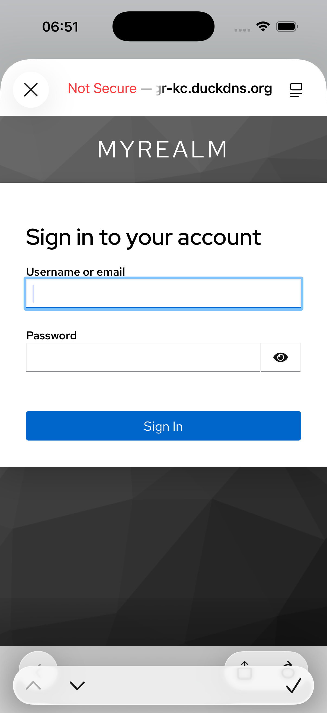

# Couchbase Notification Platform — Proof of Concept

A working notification platform on **Couchbase Server 8.0** that ingests events,
renders templated notifications, fans them out across channels, tracks delivery
with retry and backoff, and searches the result — against a live dataset of
**500 million notification instances**.

Generalised from a real engagement so any Couchbase SE can stand up their own.
Everything here was measured on a live cluster, not estimated.

| | Measured |
|---|---|
| Dataset | **521,311,132** notification instances |
| Ingest | **14,991 events/sec** sustained, 0 rejected |
| Seeding | 500M documents in **105 min** (79,386 ops/sec, 0 failures) |
| Dashboard search | **p50 5.4 ms, p95 7.2 ms, max 8.2 ms** across 139 filter combinations |
| Data on disk | 376.9 GB including replica (754 B/doc) |


---

## Quick start — hand this to Claude Code

Open [Claude Code](https://claude.com/claude-code) in a clone of this repo and
paste the prompt below. It walks you through provisioning, configuration and
verification, and adapts to choices you make along the way.

<details>
<summary><b>Setup prompt (click to copy)</b></summary>

```text
I want to stand up the Couchbase notification-platform PoC in this repo on my
own AWS account. Act as my guide: ask me one question at a time, run what you
can yourself, and tell me exactly what to run when it needs my hands.

Start by reading README.md and docs/design-spec.md so you know the architecture,
then check my environment: aws CLI, terraform, docker, pnpm, Go, and whether
infra/demo.env exists.

Walk me through, in order:

1. Scope. Ask whether I want the full 500M-document benchmark or a small
   functional demo (a few million). The answer changes the cluster size and the
   seeding time, so get it before anything is provisioned.

2. Configuration. Copy infra/demo.env.example to infra/demo.env and fill it in
   with me. I must supply the path to my own EC2 SSH key. Ask whether I have a
   DuckDNS account: if I do, take the token and use stable DNS names; if not,
   proceed with raw IPs and warn me that every instance stop/start will hand out
   new public addresses that I will have to re-enter.

   Ask whether I want my own bucket and tenant name rather than the ncgr
   default. If I do, set CB_BUCKET, CB_SCOPE and TENANT_ID now and tell me they
   cannot change after seeding - tenant_id is part of every document key.

3. Cluster. Help me provision Couchbase Server 8.0 Enterprise sized per the
   benchmark table in README.md, then run infra/setup-cluster.sh to create the
   bucket, scope, collections and indexes. Verify every index reaches "online"
   before continuing - a deferred build that silently never ran is the most
   common way this goes wrong.

4. Application. Bring up the pipeline, mock channels and dashboard with
   infra/docker-compose.yml on an app server in the same VPC. Confirm
   GET /health reports a loaded catalog (templates and event definitions
   non-zero) before declaring success.

5. Data. Run apps/seeder-go at the scale I chose. Give me a time estimate first
   and check I want to proceed. Watch for failures rather than assuming success.

6. Verify. Run infra/bench-filters.py and show me the latency table. Compare it
   against the numbers in README.md and tell me honestly whether my cluster is
   performing in the same range - if it is slower, help me work out why.

7. Mobile (ask whether I want this; it is optional and adds Sync Gateway and
   Keycloak). The iOS app has no config file - every setting is a compiled
   constant in ncgrdemo/ncgrdemo/AuthAndSyncManager.swift. Walk me through the
   block at the top of that file and set each value against what we actually
   deployed: keycloakDomain, syncGateway, tenantId, scopeName, clientId, realm.
   Warn me that tenantId, appName and clientId all default to an ncgr-prefixed
   name but are three unrelated things - Couchbase tenant, a label, and the
   OAuth2 client - so they do not change together. Then update the ATS exception
   domains and CFBundleURLSchemes in Info.plist. Getting any of these wrong
   still builds and runs: it fails as an empty inbox or a failed login with
   nothing pointing at the cause, so check them with me rather than assuming.

Rules: show me each command before running anything that costs money or takes
more than a few minutes. Never put my SSH key or DuckDNS token in a file that
git tracks. If something fails, diagnose the root cause before proposing a fix.
```

</details>

Prefer to do it by hand? See [Manual setup](#manual-setup).

---

## What it does

**Event ingestion and fan-out.** An event arrives, is matched to an event
definition, rendered against a per-channel template, and written as one
notification instance **per channel**. One event becomes an email, an SMS, a
push and a mobile-sync document.

**Delivery tracking with retry and backoff.** Every instance carries
`status` and a `delivery` sub-document. Attempts are recorded with
subdocument mutations — the document body never crosses the network and the
trial counter increments atomically, so there is no lost-update race.
Failures stay `PENDING` with an exponential-backoff `next_attempt_at`; only
exhausting `max_attempts` sets `FAILED`.

**Flood suppression and rate limiting**, driven by a policy document that is
live-editable from the UI and refreshed into an in-memory catalog — the hot
path performs zero configuration reads.

**Search over 500M documents.** Exact filters, full-text on the message body,
time windows, and any combination, with keyset pagination. Every result set can
show the exact N1QL or FTS query that produced it — useful when the point of the
demo is *how* Couchbase answered, not just how fast.


**Mobile sync** (optional second phase). Couchbase Lite on iOS, replicating
through Sync Gateway with OIDC authentication, including a conflict resolver
that keeps server-owned delivery state and device-owned read receipts from
overwriting each other.


---

## Architecture

```
                 ┌────────────────────────────────────────────┐
   load gen ───▶ │  pipeline (Go)                             │
   REST  ──────▶ │  ingest → render → fan-out → deliver       │ ──▶ mock channels
                 │  retry scheduler · policy · metrics        │     (email/SMS/push)
                 └───────────────────┬────────────────────────┘
                                     │ KV + N1QL + FTS
                 ┌───────────────────▼────────────────────────┐
                 │  Couchbase Server 8.0  (7 nodes)           │
                 │  ncgr.platform.{notifications,events,…}    │
                 └───────────────────┬────────────────────────┘
                                     │
            ┌────────────────────────┼─────────────────────────┐
            │                        │                         │
     Next.js dashboard        Sync Gateway ──▶ iOS app    Eventing
     (search, load, config)   (optional phase 2)          (device registry)
```

Three containers do the whole server side: `pipeline`, `mock-channels`, `web`.
The pipeline is a single Go process — ingest, rendering, delivery, retry
scheduling and the load generator are goroutines inside it, not separate
services.

---

## Benchmark — what a 500M-document cluster costs

This is the sizing to copy. Every figure was measured on the cluster below.

### Cluster

**Couchbase Server 8.0.2 Enterprise**, 7 nodes, `r7i` class, gp3 EBS:

| Role | Nodes | vCPU | RAM | Disk | Service quota/node |
|---|---|---|---|---|---|
| Data | 3 | 8 | 61.6 GB | 483 GB | 51,200 MiB |
| Index + Query | 2 | 16 | 123.5 GB | — | 98,304 MiB |
| Search | 2 | 16 | 123.5 GB | — | 102,400 MiB |

Plus **one application server** (16 vCPU) running the three containers.

Bucket `ncgr`: Magma storage, full eviction, 1024 vBuckets, 1 replica, active
compression. `storageBackend` and `numVBuckets` are **immutable after
creation** — get them right the first time.

### What it holds

| | Measured |
|---|---|
| Documents | 521,311,132 |
| Data on disk incl. replica | **376.9 GB** (754 B/doc) |
| Per data node | ~126 GB (29% of 483 GB) |
| GSI indexes incl. replicas | **222.7 GB** |
| FTS index | 269.5 GB |

Compression roughly halved the replicated data. **The FTS index was 2.7x
larger than estimated** — carry the measured number into any production sizing,
not a rule of thumb.

### Throughput

| | Measured |
|---|---|
| Sustained ingest | **14,991 events/sec**, 0% rejected, queue depth 0 |
| Notifications written | ~44,000/sec (3 channels per event) |
| Seeding 500M | 105 min at 79,386 ops/sec, 0 failures |

Reaching ~15k events/sec took three fixes, **none of them in Couchbase**:
sharding a hot in-process counter, raising `kv_pool_size` from the gocb default
of 1 to 8, and raising the delivery worker pool. The requirement was 1,000
events/sec; the box does fifteen times that.

### Search latency

Across **139 filter combinations** — every combination of user, app, channel,
status, seen flag and two time windows that the dashboard can produce:

| | GSI (N1QL) | FTS |
|---|---|---|
| p50 | **5.4 ms** | 295.7 ms |
| p95 | **7.2 ms** | 1,832.9 ms |
| max | **8.2 ms** | 4,238.9 ms |
| combinations served under 5 s | **139 / 139** | 139 / 139 |

**Routing is simple: full-text goes to FTS, everything else goes to GSI.**
FTS cost tracks the number of *matching* documents, so a filter matching 444M
rows takes seconds; a pre-sorted GSI scan stops at 100 rows and returns in
milliseconds regardless of corpus size.

Raw per-combination results are in `infra/bench-*.csv`, reproducible with
`infra/bench-filters.py`.

### The four indexes that matter

| Index | Entries | Disk (both copies) | Serves |
|---|---|---|---|
| `idx_multi` | 522.7M | 86.0 GB | the feed and any keyword filter |
| `idx_user_multi` | 522.7M | 86.8 GB | anything scoped to one user |
| `idx_pending_feed` | 25.0M | **6.2 GB** | the pending/retry view |
| `idx_cblite_feed` | 5 | 0.01 GB | mobile-sync documents |
| `idx_seen_feed` | 191.3M | 40.6 GB | read receipts |

Two design rules carry most of the performance:

**Put equality predicates ahead of the range key.** A composite index that
leads with a range demotes every key after it to a post-filter. Moving `user_id`
ahead of the `sort_key` range took a single-user query from **49.3 s to 1.6 ms**.

**Partial indexes are cheap and sharp.** `WHERE status = "PENDING"` indexes
25M rows instead of 522M — **6.2 GB**, 7% of the general index, and it makes the
pending view instant.

---

## Scaling down

You do not need 7 nodes to see this work. For a functional demo, a 3-node
cluster with 5–10M documents reproduces every feature at a fraction of the cost
and seeds in minutes. Keep Magma, keep the index definitions, and seed with
`--count 5000000`. Only the benchmark numbers need the full cluster.

---

## Manual setup

Prerequisites: Go 1.24+, Node 20+, pnpm 9, Docker, an AWS account, an EC2 key
pair, and a Couchbase Server 8.0 Enterprise cluster reachable from your app
server.

```bash
cp infra/demo.env.example infra/demo.env   # then edit: SSH key, hosts, creds
set -a && . infra/demo.env && set +a

# 1. Bucket, scope, collections, indexes. Idempotent.
CB_HOST=$CB_HOST_PRIVATE ./infra/setup-cluster.sh

# 2. Full-text index (only needed for message-body search)
CB_HOST=$CB_HOST_PRIVATE ./infra/apply-configs.sh fts

# 3. Application: pipeline, mock channels, dashboard
cd infra && docker compose up -d --build

# 4. Verify before seeding - a loaded catalog means templates and event
#    definitions are readable. Both counts must be non-zero.
curl -s http://localhost:8080/health | python3 -m json.tool

# 5. Seed. Start small; raise --count once it works.
cd ../apps/seeder-go && go build -o ncgr-seed .
./ncgr-seed --host $CB_HOST_PRIVATE --count 5000000 --days 90

# 6. Measure
python3 ../../infra/bench-filters.py --skip-type
```

### Using your own bucket and tenant name

`CB_BUCKET`, `CB_SCOPE` and `TENANT_ID` in `infra/demo.env` drive everything —
the services read them from the environment, every N1QL query is built from them
rather than hardcoded, `setup-cluster.sh` provisions to them, the seeder takes
the same values, and `infra/apply-configs.sh` substitutes them into the FTS,
Sync Gateway and Eventing definitions (which are posted verbatim to Couchbase
APIs and so cannot read configuration themselves).

```bash
CB_BUCKET=acme CB_SCOPE=notifications TENANT_ID=acme   # in infra/demo.env
```

Choose them **before seeding**: `tenant_id` is part of every document key, so
changing it afterwards means rewriting every document.

Dashboard on `:3000`, pipeline API on `:8080`.

### Stable addresses (recommended)

Without Elastic IPs, every instance stop/start hands out new public addresses.
Set `DUCKDNS_TOKEN` in `infra/demo.env` and install the updater on each host:

```bash
scp -r infra/duckdns ubuntu@<host>:/tmp/
ssh ubuntu@<host> 'sudo DUCKDNS_TOKEN=<token> bash /tmp/duckdns/install.sh <subdomain>'
```

Each host then repoints its own record at boot and a restart needs no
intervention. Skip it and you will re-enter addresses after every restart —
tolerable for the dashboard, genuinely expensive once mobile sync is involved,
because the Keycloak address is baked into the OIDC issuer claim. See
`infra/duckdns/README.md`.

### Mobile sync (optional phase 2)

Sync Gateway 4.1 + Keycloak for OIDC + the SwiftUI app in `ncgrdemo/`. Server
configs and deployment notes are in `infra/sg/`.

**The iOS app has no configuration file — every value below is a compiled
constant you must edit before building.** All of them are in one block at the
top of `ncgrdemo/ncgrdemo/AuthAndSyncManager.swift`. Get one wrong and the app
still builds and still runs; it just shows an empty inbox or fails to log in,
with no message pointing at the cause.

| Constant | Default | Must match | If wrong |
|---|---|---|---|
| `keycloakDomain` | `CHANGEME-kc…` | Keycloak's own `KC_HOSTNAME`, byte for byte | login fails: issuer mismatch |
| `syncGateway` | `CHANGEME-sg…` | your Sync Gateway host:4984 | replication never connects |
| `tenantId` | `ncgr` | server `TENANT_ID` | **silently empty inbox** |
| `scopeName` | `platform` | server `CB_SCOPE` | nothing replicates |
| `clientId` | `ncgrdemo` | the OAuth2 client in Keycloak **and** `oidc.providers.keycloak.client_id` in `infra/sg/db-config.json` | login fails: invalid client |
| `realm` | `myrealm` | your Keycloak realm | login fails |
| `appName` | `ncgrdemo` | nothing — a free-text label | no effect |

`tenantId`, `appName` and `clientId` all default to an `ncgr`-prefixed name but
are **three unrelated things**: the Couchbase tenant, a grouping label on the
notification, and this app's OAuth2 identity respectively. Changing one does not
imply changing the others.

Two more places outside that block:

- `Info.plist` — the `NSAppTransportSecurity` exception domains must name your
  Keycloak and Sync Gateway hosts, or iOS blocks the cleartext `http://` and
  `ws://` connections at runtime.
- `Info.plist` — `CFBundleURLSchemes` must contain the scheme used in
  `redirectURI` (`ncgrdemo` by default).




---

## Repository layout

| Path | What |
|---|---|
| `apps/pipeline-go` | the whole server side: ingest, render, deliver, retry, search API |
| `apps/seeder-go` | bulk loader; deterministic for a given `--seed` |
| `apps/mock-channels` | email/SMS/push stand-ins with controllable failure injection |
| `apps/web` | Next.js dashboard |
| `infra/setup-cluster.sh` | idempotent cluster provisioning |
| `infra/bench-filters.py` | the filter-matrix benchmark |
| `infra/sg`, `infra/eventing` | Sync Gateway and Eventing configs |
| `ncgrdemo/` | iOS app (SwiftUI + Couchbase Lite) |
| `docs/design-spec.md` | the full design, with every measurement and the reasoning behind each decision |

The design spec is the deepest artifact here. If you are adapting this for an
engagement, read it before changing the data model.

---

## Notes for SEs

**Seed deterministically.** The same `--seed` produces the same documents, so a
demo can be rebuilt exactly.

**Build indexes after seeding, not during.** All large indexes are created with
`defer_build: true` and built in one pass. Maintaining them across 500M inserts
is dramatically slower.

**Watch the FTS index size.** It was the single largest surprise in this
exercise: 2.7x the estimate, and larger than the data it indexes.

**The retry scheduler is in-process.** One pipeline container means one
scheduler by construction — no leader election, no duplicate delivery.

---

## License

Couchbase demonstration material, built on synthetic data. No customer data,
documents or identifying details are included.
